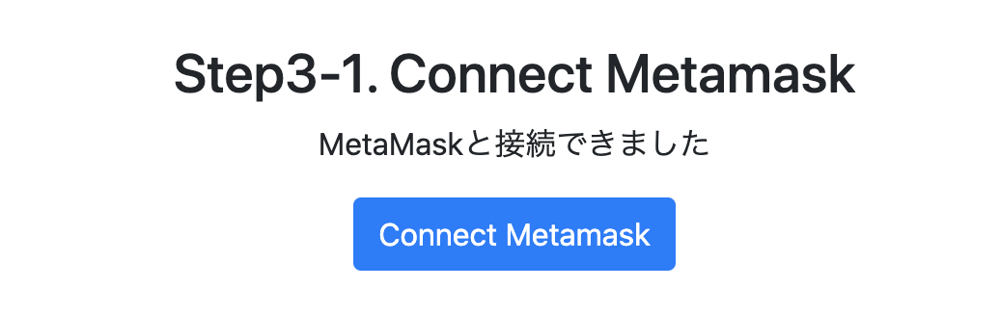

# WIDE CAMP Mar「BoFブロックチェーンアプリ開発の導入」

本BoFの目的はいわゆるWeb3業界でデファクトとなっているアプリケーションの開発手順を経験し、その課題について議論することです。
Etereumブロックチェーンで簡易的なNFTアプリ開発について解説します。

##  Step.1 事前準備

### VScode/Live Previewのインストール(任意)
本ハンズオンではVisual Studio Codeの使用を想定しています。
また、HTMLをホスティングする簡易的なローカルサーバーの起動において、プラグインの「Live Preview」を使用します。
https://azure.microsoft.com/ja-jp/products/visual-studio-code

同様の機能を使用可能な開発環境をすでに持っている方には、この手順は必要ありません。

### Metamask Walletのインストール

MetaMaskは、Ethereum系ブロックチェーンの通貨やNFTを一括で補完・管理できるソフトウェアウォレットであり、ブラウザ拡張機能版とモバイルアプリ版がある([Wikipediaより](https://ja.wikipedia.org/wiki/MetaMask))。

chromeウェブストアからchrome拡張機能のMetaMaskをインストールします。
インストール後、パスワードの設定など初期設定などを行ってください。

https://chrome.google.com/webstore/detail/metamask/nkbihfbeogaeaoehlefnkodbefgpgknn?hl=ja

https://docs.metamask.io/guide/getting-started.html#basic-considerations

### faucetからのTest ETHの取得

Test ETHを取得します（今回は我々が配布します）
https://www.alchemy.com/overviews/sepolia-testnet

以下のspled sheetにアドレスを貼り付けてください。
https://docs.google.com/spreadsheets/d/1KeGDIeuFov-7S5xz2IKmkme5ffamTRXCTVgOwffVq9k/edit?usp=sharing

### infura.ioでのAPI Keyの使用

https://www.infura.io/

## Step2. Remix IDEでのコントラクト操作

[Remix IDE](https://remix.ethereum.org/)を開きます。

### Step2-1. コントラクトファイルの作成
contractsディレクトリを開き、①のアイコンをクリックします。

ファイル名「DelightToken」を入力してコントラクトファイルを作成します。
作成したファイルに、配布資料のcontractsディレクトリ配下「DelightToken.sol」ファイルの中身をコピーし、Remixに作成したコントラクトファイルへペーストします。

### Step2-2. コントラクトファイルのコンパイル
①のアイコンをクリックし、「SOLIDITY COMPILER」画面を表示します。
②の「Compile DelightToken.sol」ボタンをクリックすると、コンパイルが始まります。

### Step2-2. コントラクトファイルのデプロイ
Remix IDEが提供するテスト環境へ、コントラクトをデプロイします。
①の「Deploy」ボタンをクリックしてください。

デプロイが完了すると、画面右下に以下のような表示が出ます。

### Step2-2. コントラクトの操作
画面左下の「Deployed Contracts」欄にデプロイしたコントラクトが表示されます。

### Step2-2. コントラクトの操作(NFT発行/情報取得)

「newItem」のplayer欄にアドレスをペーストし、tokenURI欄に任意の文字列を入力し、「tramsact」ボタンをクリックします。

これでNFTが発行できました。

次に、コントラクト情報が取得できるボタンを、以下のようにクリックし、コントラクト・NFTの情報を取得することができます。

### Step2-2. コントラクトの操作(NFTの譲渡)
トークンの譲渡を行います。

画面左上「ACCOUNT」から別アカウントのアドレスをコピーします。(この時、元の持ち主のアドレスに選択し直すこと)

from欄に「元の持ち主のアドレス」を、toにコピーした「譲渡する相手のアドレス」を、tokenIdに「1」を入力し、transactを実行してください。　

譲渡が実行された後、再びコントラクト情報が取得できるボタンを色々押してみてください。
情報が変わっているはずです。

### Step2 テストネットへのデプロイ

次にテストネットにコントラクトをデプロイします。
ENVIRONMENTを「Inject Provider - MetaMask」に変更し、Metamaskウォレットに接続します。

「デプロイ」ボタンをクリックし、Metamaskのトランザクションの「確認」をクリックします。(トランザクションが承認されるまでしばらく待ちます。)

デプロイ後のコントラクトアドレスは、後ほど利用するためを控えておいてください。

## Step3. Webアプリ開発

「app.js」を編集し、Webアプリを操作します。

### Step3-0 コントラクトアドレス、MetaMaskパスワード、Contract ABIの設定

Step2-で控えておいたコントラクトアドレス、MetaMaskウォレットのパスワードを、以下の欄に入力します。

次にContractのABIを設定します。
Remix IDEを再度開き、「FILE EXPLORORER」ページに移動します。
contracts/artifacts/build-infoフォルダ配下に、「DelightToken_metadata.json」というファイルがあります。
ファイル内のoutput.abiの配列データをコピーします。

「app.js」のCONTRACT_ABIの変数に、ペーストします。

index.htmlを右クリックし、「Open With Live Server」をクリックします。
すると[http://localhost:3000/index.html](http://localhost:3000/index.html)でWebアプリが起動します。

### Step3-1. MetaMask Walletへ接続

「Connect Metamask」ボタンを押すと、以下のように「MetaMaskと接続できました」と表示されます。

### Step3-2. NFTの発行

input欄に「http://127.0.0.1:3000/filestorage/metadatas/metadata.json」を入力した状態で、「Issue Token」ボタンをクリックします。
ここで入力したファイルURIはtokenURIとしてNFTに設定されます。

MetaMaskの確認画面が表示されます。「確認」ボタンをクリックします。(場合によってはGasの変更が必要です)

### Step3-3. NFT情報の確認
コントラクトのメソッドを実行し、コントラクトやNFTの情報を取得します。
Webアプリには以下の機能を実装しました。

- 「Total Supply」：コントラクトで発行されたNFTの総数が表示されます。
- 「Get Token Name」：コントラクトに設定したTokenの名前が表示されます。
- 「Get Token Symbol」：コントラクトに設定したTokenのSymbolが表示されます。
- 「Get TokenURI」：tokenId(例: 1)を入力すると、そのtokenIdに紐づくNFTに設定されたTokenURIが表示されます。
- 「Get Token Balace」；Walletのアドレスを入力すると、そのアドレスが所有するこのコントラクトにおけるNFTの数が表示されます。

### Step3-4 Etherscanでのトランザクションの確認
「Open Etherscan」ボタンをクリックし、Block ExplorerであるEtherScanを開きます。
トランザクションの情報について確認してみてください。

### Step3-5 NFTのメタデータ/画像を確認する。

[http://localhost:3000/filestorage/metadatas/metadata.json](http://localhost:3000/filestorage/metadatas/metadata.json)を開くとメタデータが表示されます。

メタデータに表示された[http://localhost:3000/filestorage/images/photo.png](http://localhost:3000/filestorage/images/photo.png)を開くとNFTと紐付けた画像が表示されます。

